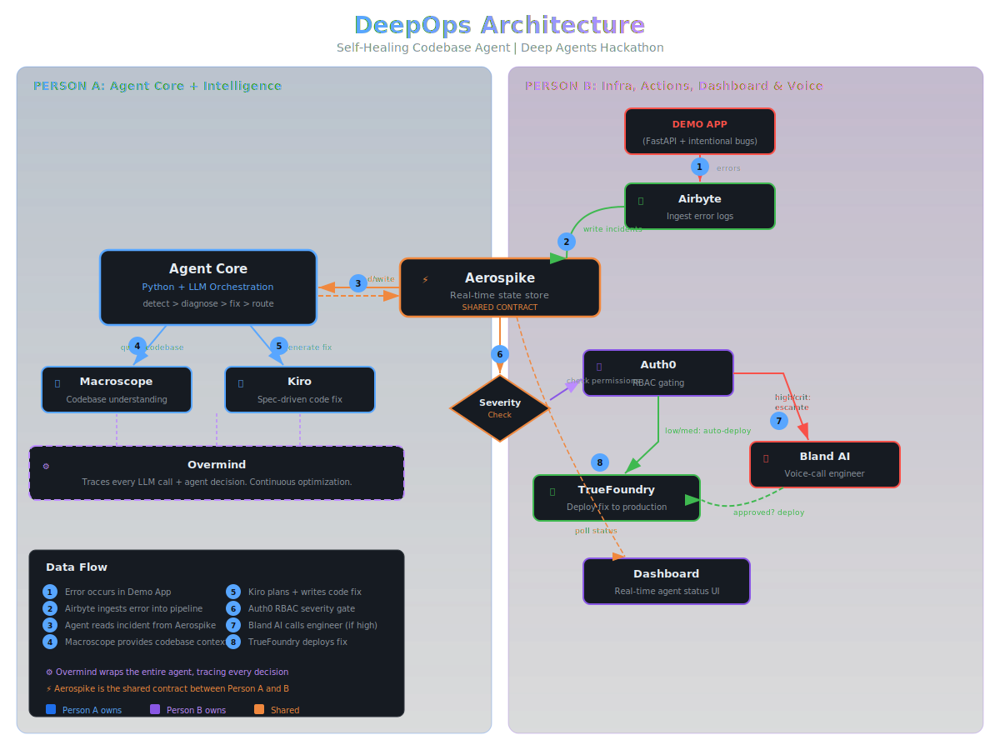

# DeepOps: The Self-Healing Codebase Agent

An autonomous agent that monitors a live app, detects errors in real-time, diagnoses root causes, writes and deploys fixes, and calls the on-call engineer only when human approval is needed.

Built for the **Deep Agents Hackathon** (March 27, 2026).



## How It Works

```
Error Detected → Ingested → Stored → Diagnosed → Fixed → Auth Check → Deployed → Resolved
   (Airbyte)   (Aerospike) (Macroscope) (Kiro)   (Auth0) (TrueFoundry) (Overmind)
```

1. **Detect** -- Airbyte ingests error signals from logs and metrics
2. **Store** -- Aerospike persists incidents, agent memory, and codebase graph
3. **Diagnose** -- Macroscope analyzes the codebase to understand root cause
4. **Fix** -- Kiro plans and writes the code fix
5. **Gate** -- Auth0 enforces RBAC severity gating (auto-deploy vs. human approval)
6. **Escalate** -- Bland AI voice-calls the on-call engineer for critical issues
7. **Deploy** -- TrueFoundry deploys the verified fix
8. **Optimize** -- Overmind traces every decision and optimizes over time

## Files

| File | Description |
|------|-------------|
| `docs/deepops-guide.md` | Full build guide with architecture, implementation steps, and demo script |
| `docs/deepops-architecture.svg` | Visual architecture diagram |
| `docs/deepops-dashboard.jsx` | React dashboard component for the live demo UI |

## Sponsor Integrations

Airbyte, Aerospike, Macroscope, Kiro, Auth0, Bland AI, TrueFoundry, Overmind -- each with a genuine, non-forced role in the pipeline.

## Team

2 full-stack devs | 3-minute live demo | The "wow" moment: a live phone call from the agent.
